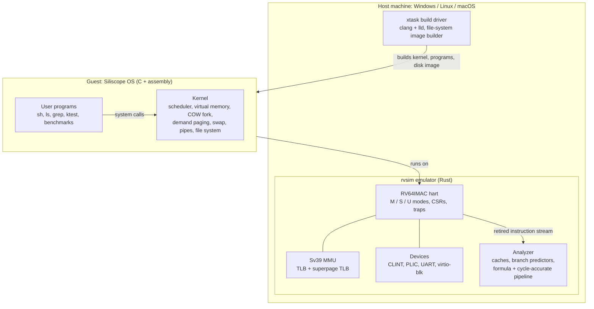
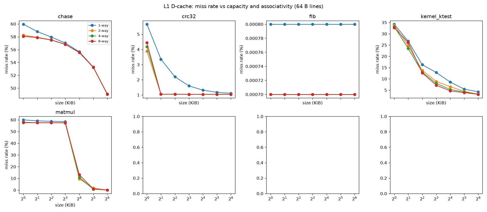
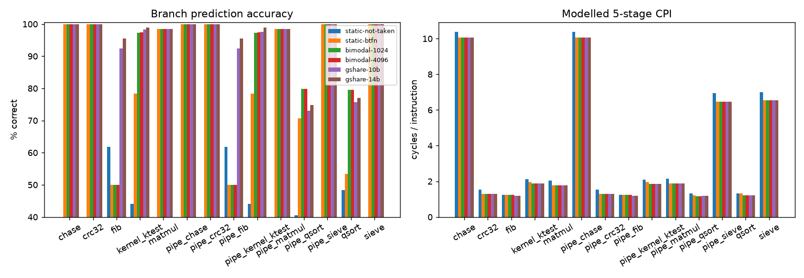
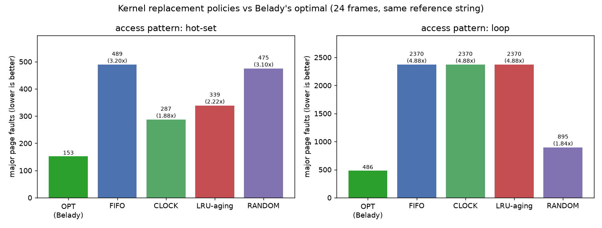
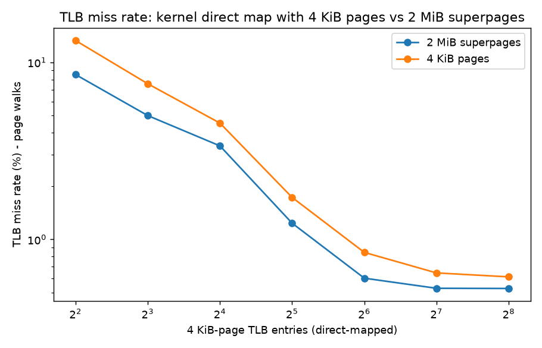
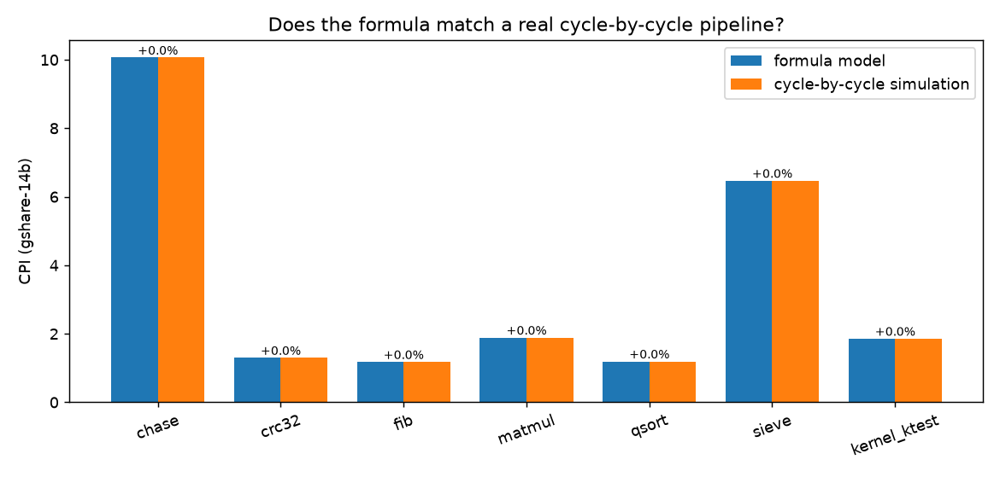

# Siliscope 

RISC-V full-system emulator, custom OS kernel and microarchitecture analyzer

Siliscope is a single project that spans **computer architecture and operating systems end to end**:

1. **A RISC-V full-system emulator** (Rust, zero dependencies): CPU with M/S/U privilege modes, Sv39 virtual memory with a TLB, interrupts, and virtual devices.
2. **An operating system written from scratch** (C + assembly) that boots on that emulator: preemptive multitasking, copy-on-write `fork`, demand paging, swapping, pipes, a file system, and a shell.
3. **A microarchitecture analyzer** built into the emulator: cache hierarchy, branch predictors, and two pipeline models (a formula and a cycle-by-cycle simulation) that check each other.

Everything runs in software, so **no hardware, no Linux VM and no QEMU** are needed. It builds and runs natively on Windows, Linux and macOS.

---

## Contents

- [Highlights](#highlights)
- [Quick start](#quick-start)
- [What you can do inside the OS](#what-you-can-do-inside-the-os)
- [How it fits together](#how-it-fits-together)
- [Features in detail](#features-in-detail)
- [Experiments and results](#experiments-and-results)
- [Verification and testing](#verification-and-testing)
- [Command reference](#command-reference)
- [Repository layout](#repository-layout)
- [Configuration knobs](#configuration-knobs)
- [Honest limitations](#honest-limitations)
- [Troubleshooting](#troubleshooting)
- [Ideas for extending it](#ideas-for-extending-it)
- [License and acknowledgements](#license-and-acknowledgements)

---

## Highlights

| | |
|---|---|
| **110 / 110** | official [`riscv-tests`](https://github.com/riscv-software-src/riscv-tests) pass (user, machine and supervisor mode, M, A and C extensions) |
| **12x fewer instructions** | for a copy-on-write `fork` vs eager copying (20 forks of a 2 MiB process), and 5 instead of 526 pages used per fork |
| **16x less memory** | with demand-paged `sbrk` (reserve 32 MiB, touch 1/16 of it: 512 frames instead of 8193) |
| **Kernel = textbook** | the kernel's FIFO, Clock, LRU-aging and Random page-fault counts match offline simulators **exactly**, and are compared against Belady's provable optimum |
| **4x faster** | late-arriving short jobs under MLFQ vs round-robin (2.5 vs 10.0 ticks), with interactive wait cut from 2.06 to 0.06 ticks |
| **1.5% max difference** | between the formula CPI model and an independent cycle-by-cycle 5-stage pipeline simulation (7 workloads x 6 branch predictors) |
| **Cross-platform results** | OS-level numbers (fault counts, scheduler times) are identical on Windows (LLVM 23) and Linux (LLVM 18) because the emulator is deterministic |

---

## Quick start

### Windows (PowerShell)

**One-time setup**

```powershell
winget install Rustlang.Rustup
winget install LLVM.LLVM          # provides clang + lld
# Rust on Windows also needs the Microsoft C++ build tools:
winget install Microsoft.VisualStudio.2022.BuildTools --override "--wait --passive --add Microsoft.VisualStudio.Workload.VCTools --includeRecommended"
# optional, for charts:
winget install Python.Python.3.12
pip install matplotlib
```

Close PowerShell and open a **new** window so the new tools are on the PATH. If `clang` is still not found:

```powershell
$env:Path += ";C:\Program Files\LLVM\bin"
```

**Every time**

```powershell
git clone https://github.com/YOUR-USERNAME/siliscope.git
cd siliscope
Set-ExecutionPolicy -Scope Process Bypass     # allows the launcher script in this window only
.\rvsim.ps1 test                              # build everything and run all tests
.\rvsim.ps1 run                               # boot the OS and get a shell prompt
```

The first run compiles everything (a few minutes). Type `halt` inside the OS to power it off.

### Linux / macOS

```sh
sudo apt install clang lld        # or: brew install llvm lld
# install Rust from https://rustup.rs
git clone https://github.com/YOUR-USERNAME/siliscope.git && cd siliscope
./rvsim.sh test
./rvsim.sh run
```
---

## What you can do inside the OS

`.\rvsim.ps1 run` boots Siliscope's own kernel and drops you into its shell (the `$` prompt). The host terminal echoes what you type.

| Command | What it does |
|---|---|
| `ls`, `cat FILE`, `echo TEXT`, `wc FILE`, `grep PATTERN [FILE]` | basic tools, all running as user programs on the guest kernel |
| `mkdir DIR`, `rm FILE`, `cd DIR` | file-system operations on the virtual disk |
| `echo hi > f`, `wc < f` | redirection |
| `ls \| grep sh`, `cat README.txt \| grep rvsim \| wc` | **pipelines** (up to 8 stages) |
| `cmd1 ; cmd2`, `cmd &` | sequencing and background jobs |
| `ktest` | in-guest regression suite: fork/wait, exec, isolation, sbrk, file system, copy-on-write, pipes, lazy sbrk, swapping, protection, kill, process-table limits |
| `schedtest`, `schedbench` | scheduler demos (round-robin vs MLFQ) |
| `forkbench`, `lazybench`, `swapbench` | copy-on-write, demand-paging and page-replacement benchmarks |
| `ps` (or `Ctrl-P`) | process table, priorities, free pages, copy-on-write fault count |
| `halt` | power off the virtual machine |

---

## How it fits together



**Boot flow.** The emulator loads the kernel ELF at `0x8000_0000` and starts in machine mode. A short stub delegates traps to supervisor mode, programs the timer and drops into the kernel, which sets up paging, the process table, the disk driver and the file system, then runs `/init`, which opens the console and starts the shell.

**Memory map** (QEMU `virt`-compatible):

| Device | Address |
|---|---|
| Test finisher (power off) | `0x0010_0000` |
| CLINT (timer, software interrupt) | `0x0200_0000` |
| PLIC (interrupt controller) | `0x0C00_0000` |
| UART 16550 | `0x1000_0000` |
| virtio-blk disk (legacy MMIO) | `0x1000_1000` |
| DRAM (128 MiB by default) | `0x8000_0000` |

**Address spaces.** Kernel mappings are identity-mapped and supervisor-only, and every process page table shares them. User code and heap start at `0x4000_0000`, with an 8-page stack at the top of the user region. See [`docs/ARCHITECTURE.md`](docs/ARCHITECTURE.md) for the trap path, scheduler, file-system layout and more.

---

## Features in detail

### Emulator (`emulator/`)

- **ISA:** RV64I + M + A + C + Zicsr + Zifencei (no floating point).
- **Privilege:** machine, supervisor and user modes; trap delegation (`medeleg`/`mideleg`); vectored trap vectors; `mstatus` SUM/MXR/MPRV/TVM/TSR/TW.
- **Virtual memory:** Sv39 page-table walker with superpages, hardware Accessed/Dirty updates, `sfence.vma`, a configurable direct-mapped TLB plus a small fully-associative superpage TLB.
- **Devices:** CLINT timer, PLIC with S-mode and M-mode contexts, 16550 UART (RX and TX interrupts), virtio block device, SiFive-style test finisher, HTIF `tohost`.
- **Deterministic:** time advances by instruction count, and input can be fed from a file, so runs reproduce exactly.

### Kernel (`kernel/`, `user/`)

- **Processes and scheduling:** `fork` / `exit` / `wait` / `kill` / `exec` (ELF), sleep/wakeup, timer-driven preemption, and a run-time switchable **round-robin / MLFQ** scheduler (3 levels, growing time slices, periodic boost, priority preemption on wakeup).
- **Virtual memory:** per-process Sv39 page tables, per-page reference counts, **copy-on-write fork**, **lazy (demand-paged) `sbrk`**, and the kernel direct map built from **2 MiB superpages**.
- **Swapping:** a resident-set limit with swap space on the virtio disk and four selectable replacement policies: **FIFO, Clock, LRU-by-aging, Random**.
- **I/O:** virtio-blk driver, buffer cache, inode file system (1 KiB blocks, 12 direct + 1 indirect block, directories, up to ~268 KiB per file), console with line discipline, blocking **pipes**.
- **System calls:** `fork exit wait read write open close kill exec fstat chdir dup getpid sbrk sleep uptime unlink mkdir halt ps pipe freepages vmctl`.
- **Protection:** user faults (bad pointers, kernel addresses) kill the offending process, not the system.

### Analyzer (`emulator/src/perf/`)

- **Caches:** L1I, L1D and unified L2 (set-associative, LRU, write-back); default 16 KiB 4-way L1 and 256 KiB 8-way L2 with 64-byte lines; miss rates and AMAT.
- **Branch predictors:** static not-taken, static backward-taken, bimodal (1K and 4K), gshare (10 and 14 bits).
- **Pipeline models:** a *formula* model (load-use, jump, mispredict, mul/div and cache-miss penalties) and an independent **cycle-by-cycle 5-stage simulation** with real hazard detection and forwarding.
- **Design-space sweeps:** `--sweep` simulates 32 I-cache + 32 D-cache geometries and 22 predictor sizes in one run and writes CSVs for plotting.

---

## Experiments and results

All numbers below were produced by this repository (`rvsim bench`, `cowbench`, `vmbench`, `tlbbench`, `pipebench`) and the raw CSVs and charts are in [`results/`](results/).

> **About compilers and platforms.** The OS-level results (page-fault counts, scheduler times, copy-on-write and TLB numbers) are deterministic and were identical on Windows (LLVM 23) and Linux (LLVM 18). The CPU-benchmark tables in sections 1 and 7 come from separate runs: the section 1 data (`results/*_summary.csv`) was generated from LLVM 18 builds, while the section 7 data (`results/pipeline_validation.csv`) was regenerated on Windows with LLVM 23. Different compilers emit slightly different code, so absolute CPI differs a little between the two (for example `matmul`: 1.78 vs 1.89). The conclusions do not change.

### 1. Branch prediction and cache behaviour

| Workload | Instructions | Best predictor (accuracy) | CPI (gshare-14) | L1D miss | L2 miss |
|---|---:|---|---:|---:|---:|
| `chase` (512 KiB pointer chase) | 2.4 M | bimodal (100%) | 10.05 | 55.6% | 41.5% |
| `crc32` | 4.4 M | bimodal (100%) | 1.30 | 1.0% | 34.3% |
| `fib(27)` | 7.5 M | gshare-14 (95.4%) | 1.18 | 0.0% | n/a |
| `matmul` 64x64 | 6.0 M | bimodal (98.4%) | 1.78 | 10.9% | 0.4% |
| `qsort` 40k | 6.7 M | bimodal (79.5%) | 1.22 | 1.4% | 7.2% |
| `sieve` 1e6 | 13.5 M | bimodal (100%) | 6.55 | 22.6% | 46.9% |
| OS boot + `ktest` | 20.2 M | gshare-14 (98.9%) | 1.88 | 5.3% | 24.1% |

What the charts show:

- **`fib`:** a bimodal predictor gets only 50% right, while gshare (which remembers branch history) reaches 95%.
- **`matmul`:** the data-cache miss rate stays near 58% until the cache reaches 16 KiB, then falls to nearly zero, because the working set finally fits.
- **Conflict misses:** direct-mapped (1-way) caches are visibly worse than 2-way and above on `crc32`, `qsort` and the OS workload.
- **Line size:** larger lines help sequential code (`sieve`, `crc32`) but *hurt* `matmul`, which walks matrix columns.

<p align="center">
  
  
</p>

### 2. Copy-on-write fork

`fork` shares every page read-only; the first write by either side copies just that page. 20 forks of a ~2 MiB process, each child writing one page (`rvsim cowbench`):

| Fork strategy | Instructions (whole run) | Modelled cycles | Pages used per fork | Ticks |
|---|---:|---:|---:|---:|
| copy-on-write | 5.6 M | 18.0 M | **5** | 6 |
| eager copy (`COW_FORK=0`) | 64.8 M | 300.3 M | 526 | 41 |

About **12x fewer instructions and 17x fewer cycles** for the whole run (identical boot cost included, so the fork-only gain is larger).

### 3. Lazy `sbrk` (demand paging)

Reserve 32 MiB but touch 1/16 of it: **512 frames used instead of 8193**. Untouched pages cost nothing and read as zero on first access. Kernel-side accesses such as `read()` into an untouched buffer fault pages in too.

### 4. Swapping and page replacement versus Belady's optimum

A 64-page heap runs under a 24-frame resident-set limit. `swapbench` prints the exact reference string it executes; the build tool replays that string through offline simulators and **Belady's OPT** (evict the page used farthest in the future, the provable minimum). Major faults, lower is better:

| Access pattern | OPT | Clock | LRU-aging | Random | FIFO |
|---|---:|---:|---:|---:|---:|
| hot set (80% of accesses to 12 pages) | **153** | 287 (1.88x) | 339 (2.22x) | 475 (3.10x) | 489 (3.20x) |
| cyclic scan of 30 pages (> 24 frames) | **486** | 2370 (4.88x) | 2370 (4.88x) | 895 (1.84x) | 2370 (4.88x) |

- With locality, Clock and LRU win; on a loop slightly larger than memory, every recency-based policy faults on **every** access and Random wins. This is the classic LRU worst case.
- The kernel's measured fault counts equal the offline simulators' counts **exactly** for all four policies, which is a strong end-to-end check of the swap implementation.
- Every access verifies the page contents, so a wrong swap-in would be caught (`corrupt = 0` in all runs).

<p align="center">
  
</p>

### 5. TLB size and kernel superpages

Workload: `ktest` + `forkbench`. The kernel's direct map is built from either 4 KiB pages or 2 MiB superpages (`KERNEL_SUPERPAGES`). Page walks, lower is better:

| 4 KiB-page TLB entries | 4 | 16 | 64 | 256 |
|---|---:|---:|---:|---:|
| kernel on 4 KiB pages | 4.07 M | 1.39 M | 259 K | 188 K |
| kernel on 2 MiB superpages | 2.61 M | 1.03 M | 185 K | 162 K |

Superpages cut page walks by about **36% with a tiny TLB and 14% with 256 entries**. The gain is moderate because user pages are still 4 KiB.

<p align="center">
  
</p>

### 6. Scheduler: round-robin versus MLFQ

3 long CPU jobs and 2 interactive jobs start together; 2 short CPU jobs arrive 10 ticks later (1 tick = 500 K instructions):

| Policy | Short jobs turnaround | Interactive wait | Long jobs turnaround | Total |
|---|---:|---:|---:|---:|
| round-robin | 10.0 ticks | 2.06 ticks | 49.0 | 49 |
| MLFQ | **2.5 ticks** | **0.06 ticks** | 47.3 | 50 |

MLFQ keeps interactive jobs responsive and finishes late short jobs about 4x sooner, at no real throughput cost.

### 7. Does the CPI formula match a real pipeline?

The original CPI numbers come from a formula (instructions plus penalty cycles). To check it, there is an independent simulator with **one latch per pipeline stage (IF ID EX MEM WB) advanced one clock at a time**: stalls propagate backwards, caches block, `mul` takes 3 cycles and `div` 20, loads forward from MEM and ALU results from EX, store data is needed late, JAL redirects from ID and branches/JALR from EX. Thirteen unit tests pin exact cycle counts (fill N+4, load-use +1, mispredict +2, JAL +1, JALR +2, and so on).

| Workload | Formula CPI | Cycle-accurate CPI | Difference |
|---|---:|---:|---:|
| chase | 10.0647 | 10.0647 | 0.00% |
| crc32 | 1.2988 | 1.2988 | 0.00% |
| fib | 1.1774 | 1.1774 | 0.00% |
| matmul | 1.8895 | 1.8895 | 0.00% |
| qsort | 1.1943 | 1.1943 | 0.00% |
| sieve | 6.4690 | 6.4689 | +0.00% |
| OS boot + ktest | 1.8578 | 1.8572 | +0.03% |

*(gshare-14 predictor, Windows build; the CSV with all six predictors is `results/pipeline_validation.csv`.)*

The largest difference over all 42 workload and predictor combinations is **1.49%** (`sieve` with the static-not-taken predictor: 6.93 formula vs 6.83 cycle-accurate). It comes from an effect the formula ignores: in a blocking pipeline an instruction-miss and a data-miss can overlap, while the formula simply adds both penalties. In an earlier build of the same benchmarks with LLVM 18, `matmul` showed a +1.54% gap, which fits another formula simplification: it charges a stall when a load feeds a store's *data*, which a real pipeline forwards late with no stall (the cycle-accurate model has a unit test for exactly this). Both models describe the same textbook microarchitecture, so this validates the formula against the pipeline rules, **not** against a real chip.

<p align="center">
  
</p>

---

## Verification and testing

| Layer | What is checked | How |
|---|---|---|
| ISA conformance | **110 / 110** official `riscv-tests` (rv64ui, um, ua, uc, mi, si) | `rvsim test` |
| Guest OS | boot, shell, redirection, pipelines, `ktest` (fork/wait, exec, isolation, sbrk, files incl. indirect blocks, COW, pipes, lazy sbrk, swap with all 4 policies, memory protection, kill, process limit) | `rvsim test` / `selftest` |
| Memory management | swap runs with zero corrupted pages and zero leaked slots; lazy sbrk saves >10x frames; kernel FIFO equals the simulator; nothing beats Belady OPT | `rvsim test` |
| Scheduler | MLFQ beats round-robin on interactive wait and late-short-job turnaround | `rvsim test` |
| Pipeline model | 13 exact-cycle unit tests; formula vs cycle simulation within 3% (observed 1.49% max) | `cargo test`, `rvsim test` |
| Page-replacement simulators | 6 unit tests incl. textbook numbers and Belady's anomaly (FIFO faults 9 to 10 when frames go 3 to 4) | `cargo test` |
| Workloads | six self-checking benchmarks (matmul, qsort, sieve, fib, crc32, chase) | `rvsim test` |
| CI | all of the above on **Ubuntu and Windows** on every push | `.github/workflows/ci.yml` |

`riscv-tests` ships as prebuilt ELFs in `tests/riscv-tests/` (BSD-3-Clause, see the license file there); `tests/build_riscv_tests.sh` rebuilds them from upstream. Four upstream tests are excluded because they need extensions or debug-trigger CSRs this CPU does not implement (Zacas and `breakpoint`).

---

## Command reference

Use `.\rvsim.ps1 <command>` on Windows or `./rvsim.sh <command>` on Linux/macOS.

| Command | What it does | Time |
|---|---|---|
| `build` | build the emulator, kernel, user programs, disk image and benchmarks | minutes (first run) |
| `run` | boot the OS and open the shell | |
| `selftest` | scripted tour of the OS (shell, files, `ktest`, scheduler) | seconds |
| `test` | run **everything** (see above); ends with `ALL TESTS PASSED` | a few minutes |
| `bench` | run the CPU benchmarks with cache/predictor sweeps, write CSVs and charts | a few minutes |
| `cowbench` | copy-on-write vs eager fork | about 1 min |
| `vmbench` | lazy sbrk, swap policies vs Belady OPT, RR vs MLFQ | about 30 s |
| `tlbbench` | TLB size sweep, 4 KiB vs 2 MiB kernel mappings | about 3 min |
| `pipebench` | formula vs cycle-by-cycle pipeline CPI | about 1 min |
| `clean` | delete the `build/` folder | |

Charts are written to `results/*.png` and need Python with `matplotlib`; the tables print either way.

**Using the emulator directly** (`target/release/rvsim`):

```text
rvsim <program.elf> [options]
  --disk          attach a virtio-blk disk image      --snapshot       discard disk writes
  --uart-input <file>  feed the UART from a file           --max-insns <n>  stop after n instructions
  --perf               cache / predictor / pipeline report --sweep          design-space sweeps (CSV)
  --cycle-model        add the cycle-by-cycle pipeline simulation
  --perf-out <prefix>  write CSV files                     --trace <file>   instruction trace
  --tlb-entries <n> --stlb-entries <n> --tlb-stats         TLB configuration and statistics
  --l1-kb <n> --l1-ways <n> --line <bytes> --l2-kb <n> --l2-ways <n>   cache geometry
```

Example: `target\release\rvsim.exe build\bench\matmul.elf --cycle-model`

---

## Repository layout

```text
emulator/src/    cpu.rs csr.rs mmu.rs rvc.rs bus.rs elf.rs main.rs
                 devices/{uart,clint,plic,virtio_blk}.rs
                 perf/{cache,predictor,pipeline,cycle}.rs
kernel/          boot.S trapvec.S start.c main.c proc.c trap.c vm.c swap.c pipe.c
                 syscall.c exec.c fs.c bio.c file.c virtio.c uart.c plic.c printf.c string.c
                 kernel.h kernel.ld
user/            init sh ls cat echo mkdir rm wc grep halt ps ktest schedtest
                 forkbench lazybench swapbench schedbench + ulib.c usys.S user.ld
bench/           bare-metal benchmarks: matmul qsort sieve fib crc32 chase
rootfs/          files copied into the guest disk (README.txt, selftest.sh)
xtask/src/       cross-platform build / test / bench driver (main.rs),
                 file-system image builder (mkfs.rs),
                 offline FIFO/LRU/Clock/aging/Random/Belady-OPT simulators (paging.rs)
tests/           prebuilt riscv-tests, guest input scripts
tools/plot.py    turns the CSVs into charts
results/         CSVs and charts produced by the benchmark commands
docs/            ARCHITECTURE.md and screenshots
.github/         workflows/ci.yml
```

About 8,000 lines of Rust, C and assembly, with no third-party dependencies.

---

## Configuration knobs

Edit these and rebuild (`.\rvsim.ps1 test` rebuilds automatically):

| Setting | File | Meaning |
|---|---|---|
| `COW_FORK` | `kernel/kernel.h` | `1` copy-on-write fork (default), `0` eager copy |
| `KERNEL_SUPERPAGES` | `kernel/kernel.h` | `1` map the kernel direct map with 2 MiB pages (default), `0` with 4 KiB pages |
| `SCHED_MLFQ_DEFAULT` | `kernel/kernel.h` | boot-time scheduler; also switchable at run time with `vmctl` |
| `BOOST_TICKS`, `NLEVELS`, `slice_ticks` | `kernel/kernel.h`, `kernel/trap.c` | MLFQ boost interval, number of levels, slice lengths |
| `PIPESIZE`, `NPROC`, `SWAPSLOTS` | `kernel/kernel.h` | pipe buffer, process table size, swap capacity |
| `LIMIT`, `WS`, `REFS` | `user/swapbench.c` | resident frames, heap pages, references (if you change `LIMIT`, also change `FRAMES` in `xtask/src/main.rs` so the Belady comparison matches) |
| `TIME_DIV` | `emulator/src/cpu.rs` | instructions per timer tick (10) |

---

## Honest limitations

- **RV64IMAC only:** there is no floating point (so not "RV64GC"). Compile guest code with `-march=rv64imac`.
- **Single hart:** no SMP, no kernel locks. Interrupts are simply off while in the kernel.
- **PMP CSRs exist but are not enforced.** No Sstc, Svpbmt or hypervisor extension.
- **The timing numbers come from models, not hardware.** Both pipeline models describe a textbook 5-stage in-order machine with a perfect branch target buffer, and wrong-path instructions are represented as idle fetch cycles. They are validated against each other, not against a real chip.
- **Swapping covers demand-allocated, unshared heap pages only** (not the program image, stack, page tables or COW-shared pages), and the resident cap is an experiment setting, not automatic memory-pressure handling.
- **Accessed/Dirty bits are updated in hardware by the emulator;** Clock and LRU-aging read the Accessed bit.
- The kernel follows well-known teaching-OS designs (xv6-style structure); it is not a novel design.
- The interpreter runs roughly 10 to 15 million instructions per second with the analyzer on (varies by machine). There is no JIT and no GDB stub.
- Booting stock xv6 or Linux is **not** tested here (the machine mimics QEMU `virt` and uses the legacy virtio interface xv6 expects, so it is a reasonable next step).

---

## Troubleshooting

| Symptom | Fix |
|---|---|
| `clang` or `cargo` "is not recognized" | Reopen PowerShell after installing, or run `$env:Path += ";C:\Program Files\LLVM\bin"` |
| `linker 'link.exe' not found` | Install the Visual Studio C++ Build Tools (see Quick start) |
| "running scripts is disabled" | Run `Set-ExecutionPolicy -Scope Process Bypass` in the same window |
| `kernel panic: virtio_disk_intr status` or "no swap area" | A stale build from an older version is being reused (can happen after extracting a new copy over an old folder). The launcher wipes stale files automatically when `VERSION` changes; to force it, delete the `target` and `build` folders and run `.\rvsim.ps1 test` again |
| Charts not generated | Install Python and run `pip install matplotlib` (tables still print without it) |
| Typed input appears twice | The host terminal echoes input; the guest kernel does not. Report it if you see doubling |

---
